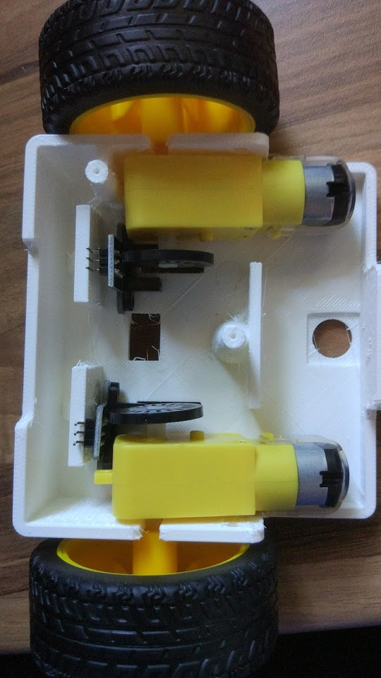

# TuWi (Two Wheels & Zowi)

[Tuwi](https://brico3d.blogspot.com/2017/06/tuwi-twowheels-robot.html) es un robot creado por @brico3d

Se trata de un robot que usa dos motores DC muy económicos (de los amarillos de aliexpress) y unos tacómetros para medir su movimiento con precisión.

Está controlado por un Arduino Nano, y para el control de los motores usa un L293B y se puede controlar por Bluetooth desde la apllicación [Bluetooth Joystick Commander](https://play.google.com/store/apps/details?id=org.projectproto.btjoystick&hl=es)

## Componentes

* [Diseño para imprimir](https://www.thingiverse.com/thing:2394027)
* [Código y librerías](https://github.com/brico3d/Tuwi)

## Montaje

## Ideas

* Añadir una matriz )de leds (5x7) para hacer gestos
* Sensores siguelíneas
* Medir giros y distancias ¿Usar como esconabot?
